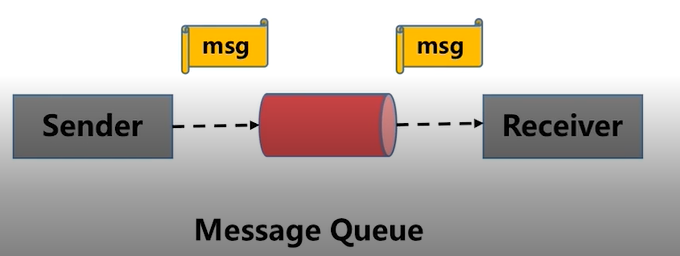
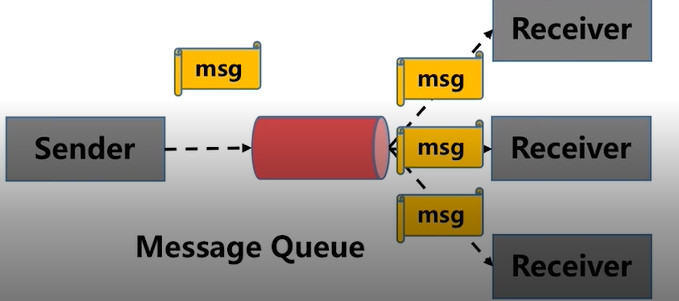
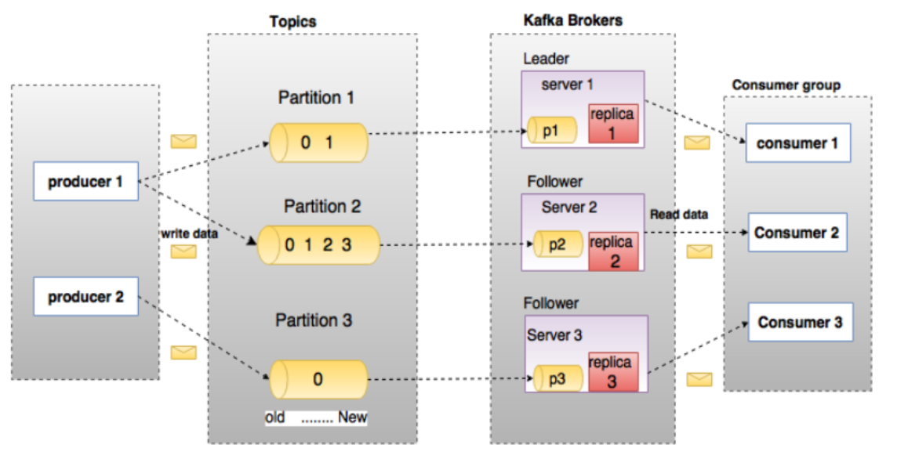

**Kfaka——消息系统**
1. 什么是消息系统？
   消息系统就是负责将数据从一个应用传递到另一个应用，不用关注数据传递的细节；分布式消息传递基于可靠的消息队列，在客户端和消息系统之间异步传递消息，有两种主要的消息传递模式：
   （1）点对点消息传递模式：
		   生产者发送一条消息到消息队列中，一条消息只能被一个消费者消费一次，消费某条数据后，该条数据将从消息队列中删除，即使有多个消费者同时消费数据，也能保证数据处理的顺序；

	
  （2） 发布-订阅消息传递模式：
  			消息被持久化到一个topic中，消费者可以订阅一个或多个topic，消费者可以消费该topic中的所有数据，同一条数据可以被多个消费者消费，消费后数据不会被立即删除，这种模式经常使用，kafka也是这种模式。

2. 什么是Kafka
   Kafka是在大数据背景下产生的分布式消息队列，用于应对海量数据的处理场景，具有高性能、良好扩展性和数据持久性等特点。
3. kafka的结构
   
   kafka由生产者、代理和消费者三类组件构成，生产者将数据推送给代理，消费者从代理商拉取数据进行处理，而代理通过ZooKeeper进行协调和管理，生产者和消费者可根据业务需要自定义开发，代理中的消息被划分为多个topics,同属于一个topics的所有数据被分为多个partation，以实现负载均摊和数据并行处理。