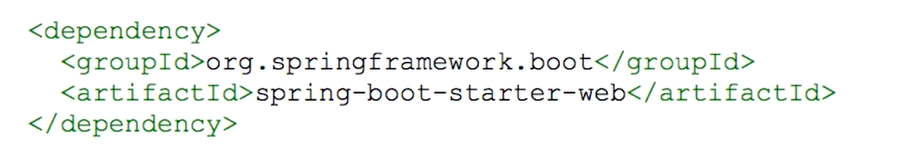

# Spring
1. 目的：
		进行企业级Java项目的应用开发，替代重量级框架，比如EJB，实现了轻量级的Java开发应用框架。
2. 实现：
	主要通过以下4个策略现其低耦合和模块化：
	（1）基于POJO对象和最小侵入式编程；
	（2）基于依赖注入（DI）和面向接口实现低耦合；
	（3）基于切面和惯例进行声明式编程；
	（4）基于切面和样板减少样板式代码；
	其中IOC（控制反转）和AOP（面向切面）是核心：
	（1）IOC：控制反转也就是依赖注入DI，传统的开发过程中，如果一个对象依赖于于另一个对象或其他资源，需要自己主动去创建new一个对象，这样一来就会有很高的耦合度，在修改或测试时经常会“牵一发而动全身”，而IOC的思想就是通过一个第三方机构即IOC容器来实现对象之间的依赖配置，即对象自己不需要再去主动创建依赖对象，只需要让IOC进行配置即可，这样一来大大降低了耦合度。
	（2）AOP：面向切面，对OOP面向对象进行了扩展，OOP是从上到下的，AOP可以实现从左到右，即对于一些基础的常用的且与业务核心功能无关的模块可以使用AOP的思想插入进去，常见的如用户登录模块、日志模块，这些模块与业务的功能无关，但每实现一个新的业务时又都需要经过这些模块，如果是传统的OOP，则每开发一个新的项目都要重新写这些模块，而AOP可以把这些模块提取出来进行插入。
3. Spring MVC
	主要用于web应用开发和网络接口，是Spring的一个模块，通过一些预定义的组件构成一个war包，通过web容器进行启动。

	
	
# SpringBoot
   1. 目的：实现自动配置，降低项目搭建的复杂度；SpringBoot通过一套默认配置降低复杂度；
	2. 两个特性：
	（1）@SpringBootApplication：

这是一个复合注解，包括@ComponentScan，@SpringBootConfiguration，@EnableAutoConfiguration
	（2）自动配置（starter）:
	可以将starter视作一种服务，使得开发者不需要具体的配置信息便可使用某项功能：例如：
	
	上图便说明通过starter-web，便可自动加入Tomcat容器，常见的starter会包含以下几种文件：
 - 自动配置文件：根据classPath是否存在指定的类来决定是否执行该功能的自动配置；
 - 	spring.factories：指导SpringBoot找到自动配置文件；
 - 	endpoint：一个个的mean，包含对服务的描述，界面等；
 - 	health indicator：健康指标；