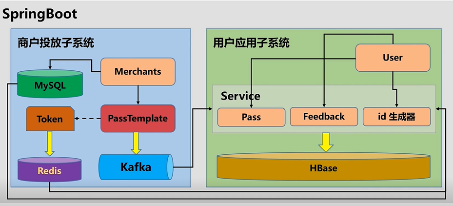

# 应用架构设计
	根据之前的应用分析，项目选择SpringBoot框架，总共分为商户投放子系统和用户应用子系统，其中，商户投放子系统的架构为：
 - 商户信息存储在Mysql中，并具有唯一的token，可作为商户的标识用于安全验证；
 - 商户接入之后可投放优惠券，投放的优惠券通过Kafka可被用户消费；
 - 另外优惠券也会有对应的token，通过redis存储；
用户应用子系统的架构：
 - 用户信息、用户-优惠券信息、优惠券-商户信息、反馈信息通过Mysql存储；
 - 通过Kafka用户“订阅”优惠券
  

# 缓存设计
	在上面的应用架构中提到了将优惠券的token存储在redis中，因为如果将token信息存储在文件中，会消耗大量的IO时间，所以可以将优惠券的token信息存放于缓存中，共分为两部分信息:（1）商户投放优惠券的初始token信息；（2）用户使用优惠券的token信息。在Redis中通过Set结构存储，因为不重复且无序满足优惠券token的特点；
	另外商户的信息也可以存放于缓存中，因为商户的数量较少且会经常使用，所以可以将其存储于Redis的hashmap结构中；
	如下图所示：
	
	
# 日志设计
1. 为什么需要日志？
    （1）进行事件查询；
	（2）记录用户行为进行分析；
2. 日志分类：
   （1）记录日志：记录系统事件；
   （2）分析日志：用来对用户的行为操作进行分析以改进系统；
3. 日志内容：
   （1）记录日志：只需要记录事件，不需要进行分析；
   （2）分析日志：用户动作、用户Id、时间戳（由服务器生成）、用户Ip地址、行为信息（用户请求数据和服务器处理数据）