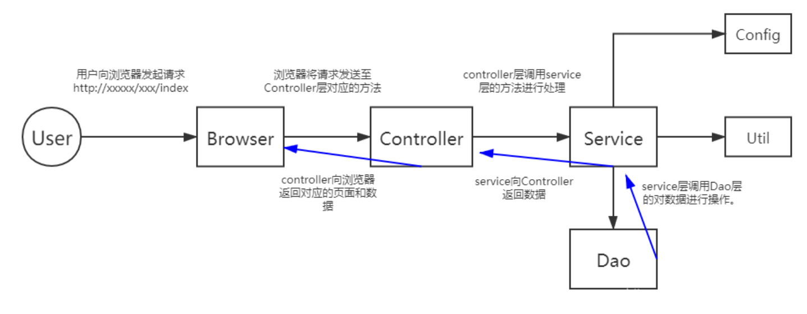

# SpringBoot中各层之间的关系
SpringBoot中分为controller 层、service层、dao层、entity层
（1）entity层和model层一样，存放实体类，属性值与数据库中的属性值保持一致；
（2）dao层：即mapper层，对数据库进行持久化操作，即增删改查，只是一个接口，只有方法名字；
（3）service层：业务逻辑处理，不直接对数据库进行操作，提供controller层调用的方法；
（4）controller层：控制器层，调用service方法，controller通过接收前端传过来的参数进行业务操作；
对于一个web项目，从发起请求到响应的流程是这样的：
