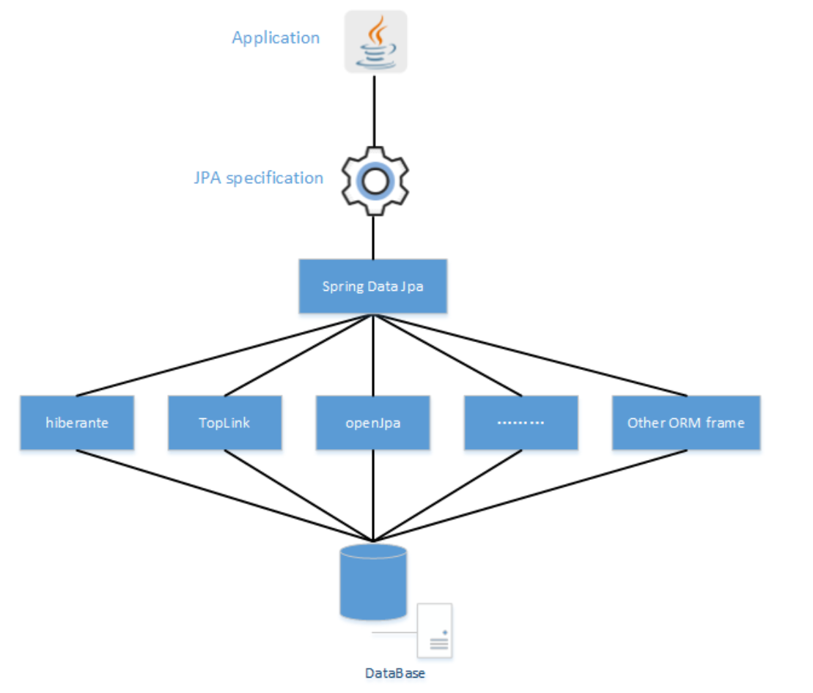

# JPA\Spring Data JPA\Hibernate
1. JPA
    上一篇博文中已经提到JPA是SUN公司提出的一种ORM规范，而不是一种具体的ORM框架，使用JPA规范，开发者就可以面向JPA规范的接口，而底层的JPA实现是可以任意切换的，比如Hibernate或TopLink可以任意切换，这样开发者就不用使用一个框架而去学习。具体使用时在entity层中的实体类上使用@Entity\@Table\@Id\@Column等注解即可。
2. Spring Data JPA
   首先Spring Data是Spring 社区的一个子项目，主要用于简化数据访问，使得数据库的访问更加方便快捷，它可以提供很多模板操作；其中Spring Data JPA就是在实现JPA规范的基础上封装的一套JPA应用框架，它出现的动机是因为：虽然JPA规范可以使得开发者不用具体学习某一套框架，只需面对JPA接口，但是在不同的ORM框架之间切换时仍然需要编写不同的代码，所以为了省去这个操作,Spring Data JPA出现了，它能够方便大家在不同的ORM框架之间进行切换而不用修改代码。在项目中具体表现为：继承JpaRepository接口。
3. Hibernate
   是具体实现JPA的一套ORM框架，也就是JPA的提供者或实现，而Spring Data JPA不是JPA的提供者，它是一个库，在JPA提供程序也就是Hibernate的顶部添加了一个额外的抽象层，Spring Data JPA始终需要JPA提供者。

# Spring Data JPA
Spring Data JPA主要有以下几个接口，根据不同的需求去继承不同的接口：
1. Repository：这是一个最基础的接口，用来标识继承它的均为仓库接口类，其中没有任何方法，当有一些方法不想使用时，比如只想让使用增删操作，不能进行查询操作，就可以用这个接口；
2. CrudRepository：继承自Repository，实现了一组CRUD相关的方法，继承该接口后可以直接使用简单的CRUD操作；
3. PagingAndSortingRepository：继承自CrudRepository，实现了一组分页排序相关的方法，继承该接口就可以实现分页和排序的功能；
4. JpaRepository：继承自PagingAndSortingRepository，即可以实现CRUD操作又提供分页及排序功能；
5. JpaSpecificationExecutor：该接口不属于Repository体系，只是提供了JPA cRiteria的支持。