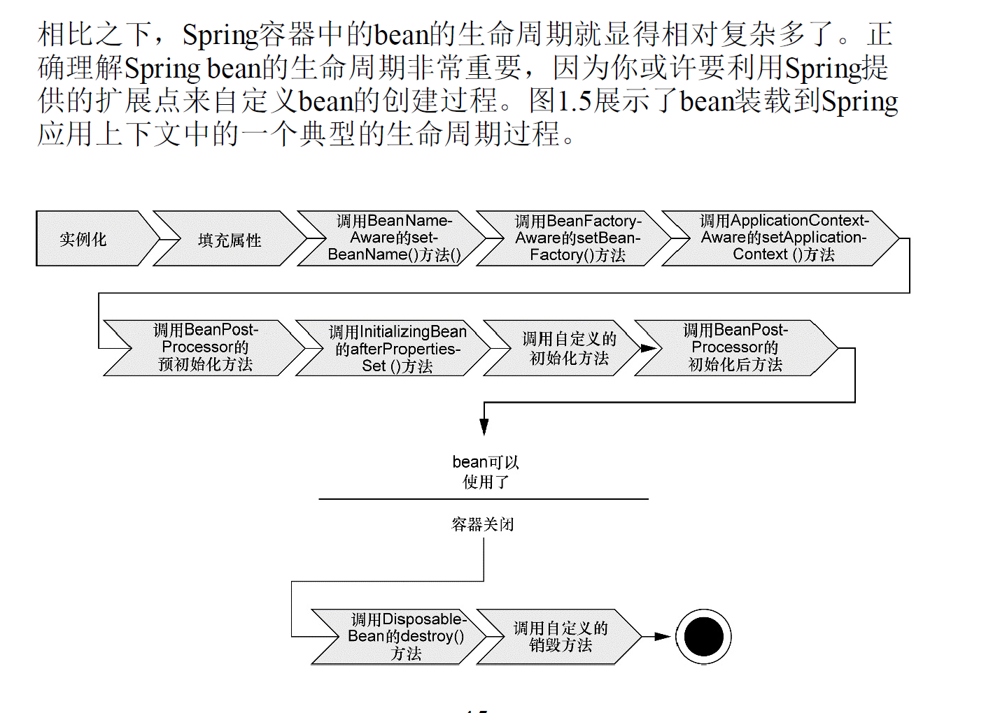

# 一、Spring简介
	Spring是为了替代重量级的企业级Java技术而创建的，尤其是EJB，Spring提供了更加轻量级和简单的编程对象，其简化Java开发主要采取了以下4种策略：
	
 1. 基于POJO对象和最小侵入式编程：
     POJO是简单老式对象，是指不需要遵守任何规范的java对象，最小侵入式编程是指不需要继承或实现Spring框架本身的类或接口，像早期的EJB、Struts等框架等强迫应用继承它们的类或实现它们的接口从而导致应用于框架绑死，而Spring不会强迫，相反在基于Spring的应用中，它的类没有任何痕迹表明你使用了Spring。
	 
  2. 通过依赖注入DI和面向接口实现松耦合：
     传统的编程中如果对象需要使用其他的对象或资源，需要自己去新建一个其他对象，这样的做法会非常复杂，而且耦合度很高，复用性和可测试性很低，Spring中通过依赖注入实现了组装应用对象，借助这种方式应用对象不需要知道依赖来自何处或者依赖的实现方式，有效的降低了耦合度。
 
   3. 基于切面AOP和惯例实现声明式编程：
      应用中通常会有很多和业务逻辑无关的组件，比如日志、安全验证、事务管理等，这些组件会被多个业务使用，分散在多个组件中，会带来很高的复杂度，而AOP会使这些服务模块化，并以声明的方式将它们应用到它们需要影响的组件中去，这种方式可以使组件具有更高的内聚性并且会更加关注自身业务。
	  
  4. 基于切面和模板减少样板代码：
     可能会重复使用很多样板式代码，比如JDBC中每次使用数据库时都需要:创建数据库连接、创建语句对象、查询、获取结果集、关闭连接、语句和结果集等一系列操作，但实际上只有少量的代码与业务相关，这种样板式代码使得代码冗余，Spring通过模板封装来消除样板式代码。
	 
           以上4种策略就是Spring简化Java开发的主要“工具”，在Spring发布的版本中有20个不同的模块组成，这20个模块可以分为6大类：数据访问与集成、Web与远程调用、面向切面编程、Instrumentation、Spring核心容器、测试，其中容器是Spring框架最核心的部分，它管理着Spring应用中bean的创建、配置和管理。所有的Spring模块都构建与核心容器之上。

# 二、Spring容器
		Spring容器是Spring的核心，它负责创建对象、装配它们并管理它们的整个生命周期，从生存到死亡。Spring容器中包含Spring bean 工厂，为Spring提供了DI的功能，Spring容器并不是只有一个，可以归为两种类型：
 1. Bean工厂：是最简单的容器，提供基本的DI支持，现在通常不怎么使用。
 2. 应用上下文：基于BeanFactory构建，可以提供应用框架级别的服务，例如从属性文件解析文本信息以及发布应用事件给感兴趣的事件监听者。其中Spring自带了多种类型的应用上下文，比如AnnotationConfigApplicationContext，AnnotationConfigWebApplicationContext，ClassPathXmlApplicationContext，FileSystemXmlapplicationcontext,XmlWebApplicationContext。
    可以根据以上几种类型的应用上下文从指定的位置加载应用上下文，此时Spring容器已准备就绪，可从中获取bean或进行装配。
	
             Spring容器可以管理bean的声明周期，传统的应用中bean的声明周期即从new开始，等到不被使用时由Java自动进行垃圾回收，而Spring容器中的bean的生命周期相对复杂，下图是bean装载到Spring应用上下文中的一个典型的生命周期过程：
			 
			
		创建和加载好一个Spring容器后，需要将应用对象装配进Spring容器中，从而使用Spring的DI机制。

# 三、Spring装配Bean
		Spring容器负责创建应用程序中的bean并通过DI来协调这些对象之间的关系，可以通过三种方式告诉Spring要创建哪些bean并且如何将其装配在一起：
		
  1. 隐式的bean发现机制和自动装配：
   这种自动化装配方式主要从两个角度实现：（1）组件扫描：即自动发现应用上下文中创建的bean；（2）自动装配：自动满足bean之间的依赖。
	使用@Component注解可以告诉Spring要为这个类创建bean，表明该类会作为组件类；@CompoentScan注解会启用组件扫描，即使用该注解的类会默认扫描与配置类同包或子包中的所有组件类。
	借助@Autowired注解可以实现自动装配，@Autowired是Spring中特有的注解，@Inject是Java依赖注入规范中的注解，可以互相替换
    
	     很多场景中都能通过组件扫描和自动装配实现Spring的自动化配置，但是有时候自动化配置的方案行不通，比如想要将第三方库中的组件装配搭配应用中，没有办法再类上添加@Component和@Autowired注解，因此必须使用显式装配的方式，显示配置有两种可选方案：Java和XML：
  2. 在Java中进行显式配置：
   使用可重构的JavaConfig进行显示配置
 - 创建配置类：首先使用@Configuration注解表明该类是一个配置类
 - 声明bean：使用@Bean注解声明bean；
 - 实现注入：引用创建bean的方式，在构造函数中传入要引用的bean。
   
  3. 在XML文件中进行显式配置：
    最开始出现的就是XML描述配置。
	
	还可以使用混合配置。

# 四、面向切面的Spring
	日志、安全和事务管理这些问题不应该作为应用对象主动参与的行为，为了让应用对象只关注于自己所针对的业务领域问题，Spring的另一核心就是AOP。
	使用DI管理和配置，有助于应用对象之间的解耦，而AOP可以实现横切关注点与它们所影响的对象之间的解耦，其中横切关注点即散布于应用中多处的功能，从概念上是与应用的业务逻辑相分离的。
	在使用面向切面编程时，仍然要在一个地方定义通用功能，但是可以通过声明的方式定义这个功能要以何种方式在何处应用，而无需修改受影响的类，横切关注点可以被模块化为特殊的类，这些类被称为切面。
	描述切面的常用术语有：
 1. 通知（Advice）：即切面的工作，除了描述切面要完成的工作，通知还解决了何时执行这个工作的问题，Spring切面中有5种类型的通知：前置通知（Before）、后置通知（After）、返回通知（After-returning）、异常通知（After-throwing）、环绕通知（Around）
 2. 切点（pointcut）：如果说通知定义了切面的“什么”和“何时”的话，切点就定义了“何处”，一个且慢并不需要通知应用的所有连接点，切点有助于缩小切面所通知的连接点的范围。
 3. 连接点（join point）：即应用程序中可以应用通知的时机，在应用执行过程中能够插入切面的一个点，可以是调用方法时、抛出异常时等，利用这些点切面代码可以插入到应用的正常流程之中，并添加新的行为。
 4. 切面（Aspect）：就是通知和切点的结合。
 5. 织入（Weaving）：把切面应用到目标对象并创建新的代理对象的过程，在目标对象的生命周期里有多个点可以进行织入：
    （1）编译器：切面在目标类编译时被织入，这种方式需要特殊的编译器，AspectJ的织入编译器就是以这种方式织入切面的；
	（2）类加载期：切面在目标类加载到JVM时被织入，需要特殊的类加载器，AspectJ的加载时织入（LTW）就是以这种方式织入切面；
	（3）运行期：切面在应用运行的某个时刻被织入，AOP容器会为目标对象动态创建一个代理对象。
	
	    Spring提供了4种类型的AOP支持：
		
 1. 基于代理的经典Spring AOP；
 2. 纯POJO切面；
 3. @AspectJ注解驱动的切面；
 4. 注入式AspectJ切面。
     
	    其中前3种都是Spring AOP实现的变体，Spring AOP构建在动态代理基础上，因此Spring对AOP的支持局限于方法拦截。

		  

