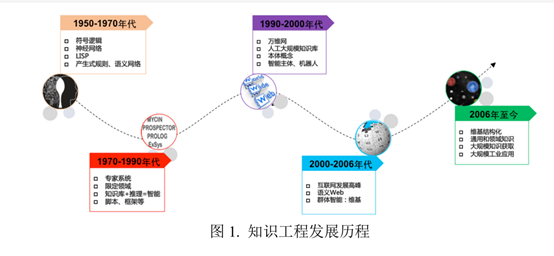

**一、背景**
1.	Web技术的不断发展：Web1.0时代-->Web2.0时代-->Web3.0时代；
2.	早期语义网络的发展奠定了基础，和专家系统之间的联系；
3.	Google为了提高搜索引擎的能力，增强用户搜索质量及搜索体验正式提出；

**二、定义与架构：**
2.1 概念
（1）官方定义：Google用于增强其搜索引擎功能的知识库。
（2）本质上：一种揭示实体之间关系的语义网络，用来描述现实世界中存在的各种实体和概念，以及它们之间的关联联系。
（3）知识图谱 VS 本体、知识库、专家系统：
本体：领域术语集合；
知识库：知识集合；
专家系统：基于规则且大多是人工构建；
知识图谱：图状具有关联性的知识集合，可以作为专家系统的一部分存在，提供半自动构建知识库的方法。
（4） 通用表示方式：三元组G=（E，R，S）其中，E是实体集合、R是关系集合、 代表知识库中的三元组集合。即可以用（实体1，关系，实体2）或（概念，属性，属性值）来表示。
（5） 类型：通用知识图谱和行业知识图谱。
2.2 逻辑架构
（1）模式层：通过本体库规范数据层的一系列知识表达，本体是结构化知识库的概念模板。
（2）数据层：由一系列的事实组成，知识以事实为单位进行存储，以三元组进行表示时可以使用图数据库作为存储介质。
2.3 体系架构

构建知识图谱：
从原始的结构化、半结构化、非结构数据，采用一系列自动或者半自动的技术手段，从原始数据库或第三方数据库中提取知识事实，将其存入知识图谱的数据层和模式层的过程。
其中包括四个阶段：
（1）知识提取；
（2）知识表示；
（3）知识融合；
（4）知识推理；
构建方式：自顶向下 VS 自底向上
（1）自顶向下：先定义好本体与数据模式，再将实体加入到知识库中。Eg: Freebase
（2）自底向上：从一些开放数据库链接中提取出实体，选择置信度较高的加入到知识库中，再构建顶层的本体模式。Eg: Google的knowledge vault模式。
一些代表性知识图谱库：

**三、相关技术：**
3.1  知识提取
   任务：从一些开放数据库中的半结构化、非结构化的数据中提取出实体、关系、属性等知识要素。
  3.1.1实体抽取     
（1）基于规则与词典的实体抽取方法：
编写规则或模板——》在原始语料中进行匹配；
（2）基于统计机器学习的实体抽取方法：
对原始语料进行训练——》使用训练得到的模型识别实体；
（3）面向开放域的抽取方法：      
从少量语料扩展到海量语料中：迭代方式扩展实体语料库、无监督学习的开放域聚类算法。
3.1.2关系抽取
（1）人工构造语义规则及模板识别实体关系
（2）使用实体关系模型
（3）信息抽取框架OIE
3.1.3属性抽取       
实体的属性可以看做实体与属性值之间的一种名称性关系，可以将实体属性的抽取问题转换为关系抽取问题。 
3.2 知识表示
早期的知识表示通常基于三元组的形式，其中存在着计算效率、数据稀疏等诸多问题。近年来，基于深度学习的发展，知识表示学习技术多将实体的语义信息表示为稠密低维实值向量，进而在低维空间中高效计算实体、关系及其语义关联。
3.3 知识融合
任务：高层次的知识组织，将来自不同知识源的知识在同一框架规范下进行异构数据整合、消歧、加工、推理验证、更新等，以形成高质量的知识库。
**四、典型应用：**
 智能搜索、深度问答、社交网络、垂直行业应用（金融、医疗、电商等领域）
**五、未来挑战：**
5.1	知识获取：基于大规模开放域的知识抽取研究仍处于起步阶段；跨语言的知识抽取方法也是研究热点；
5.2 知识表示：对复杂的知识类型、多源信息融合中的知识表示其表达能力仍然有限。
5.3 知识融合：大规模知识库环境下的研究方向：并行与分布式算法、众包算法；跨语言知识库对齐。
                             
